# Chat App - Flutter

A chat application I wrote to use with my friends. I created this project to
experience how effective Riverpod is as a state management tool. This project,
written in Flutter, uses Firebase features such as authentication, storage, push
notifications and real-time database. For chat features, I used my own socket
server written in node.js.

## Screenshots

|                                            |                                            |                                           |
| ------------------------------------------ | ------------------------------------------ | ----------------------------------------- |
| 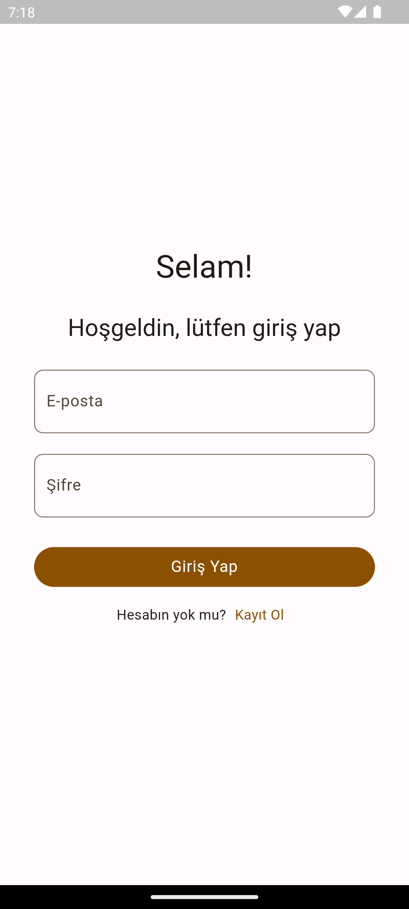  | 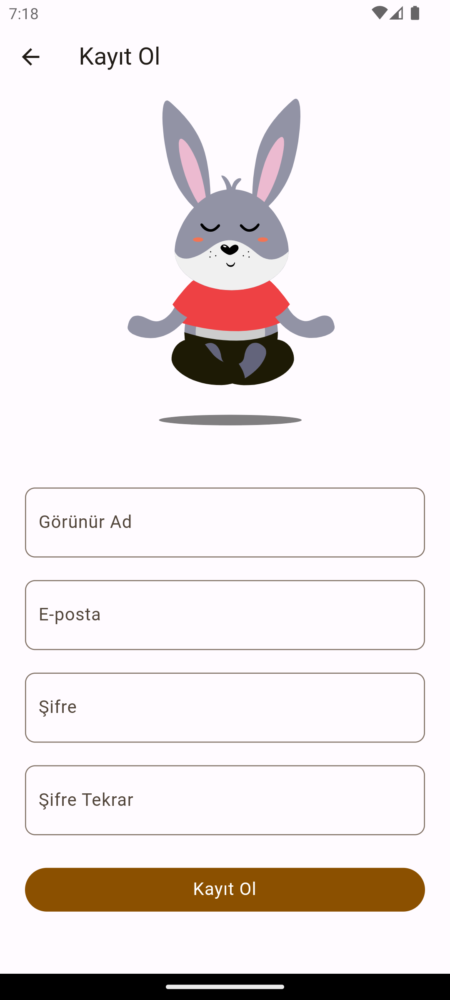  |                                           |
| 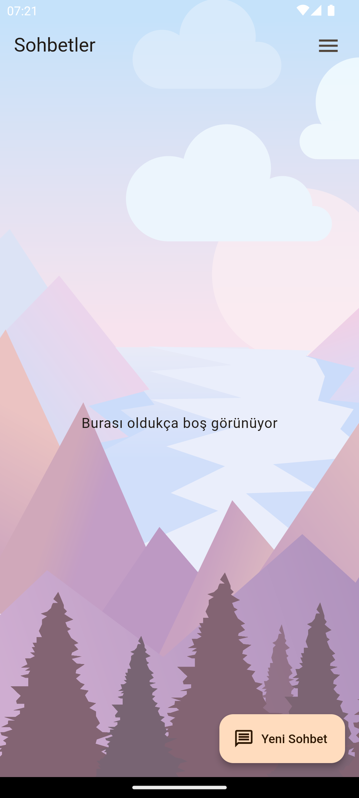  | 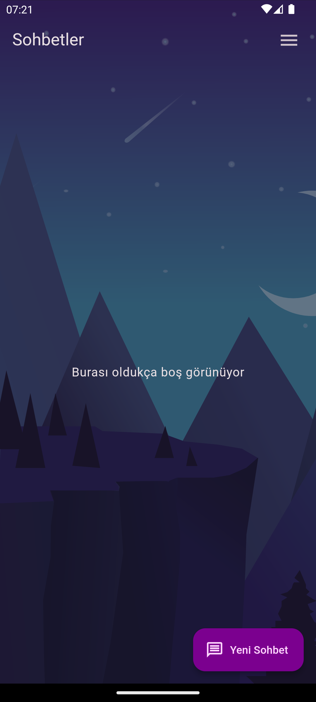  |                                           |
| 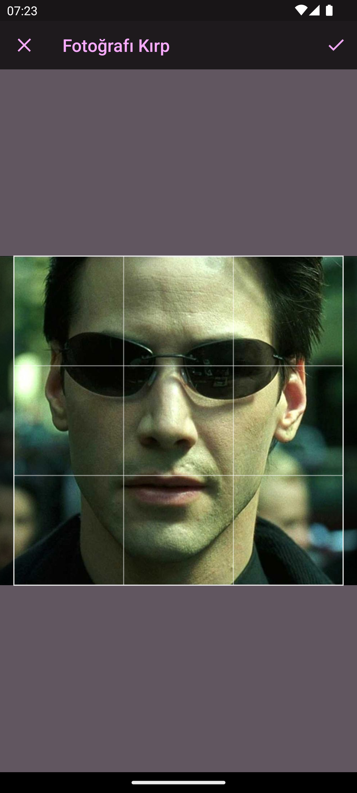  | 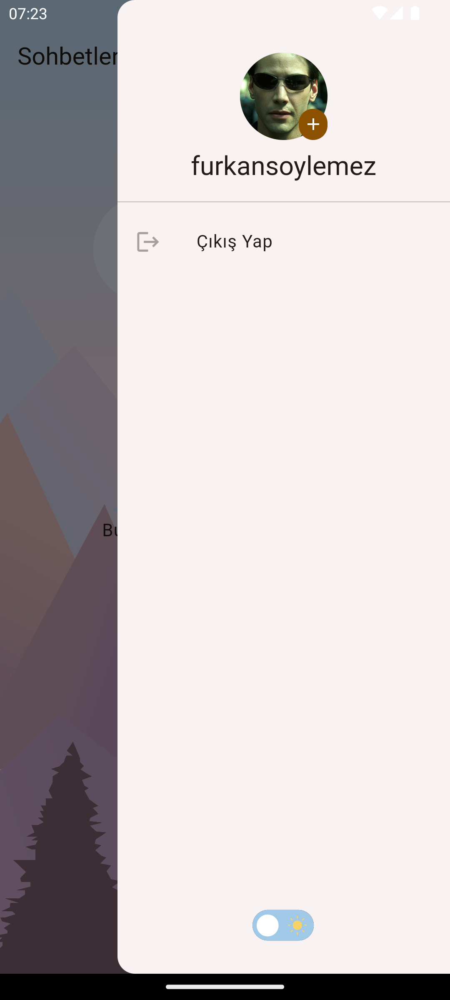  | 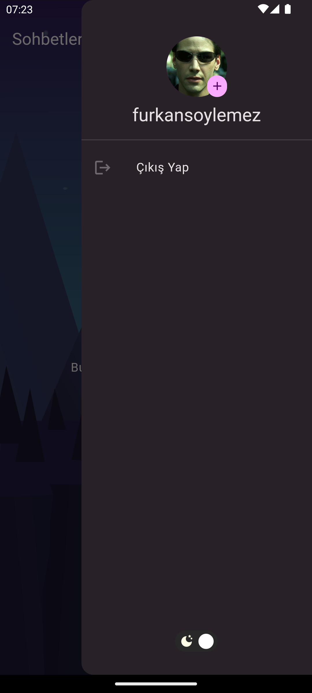 |
| 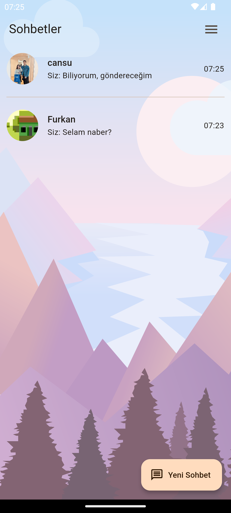  | 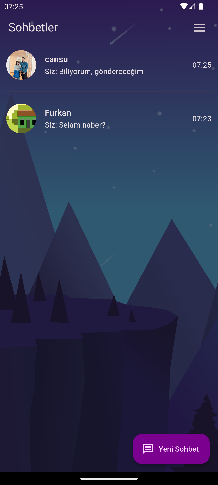  |                                           |
| 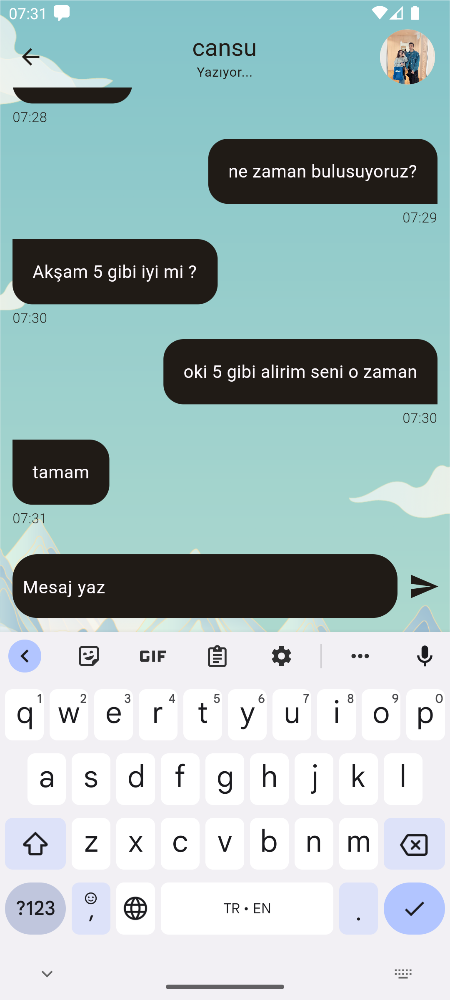 | 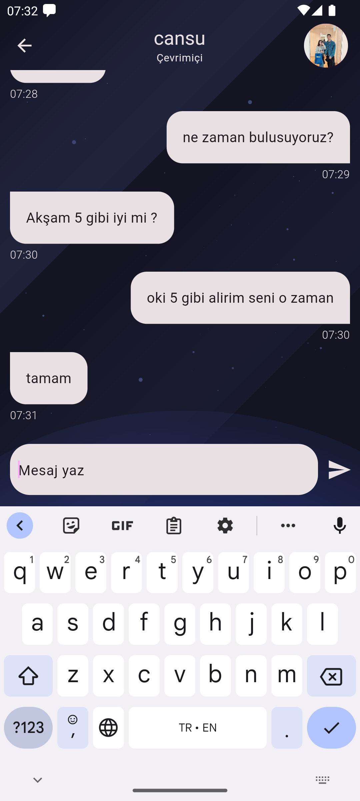 |                                           |
